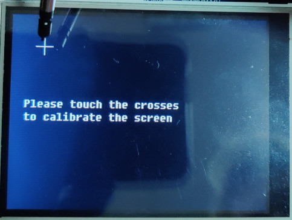
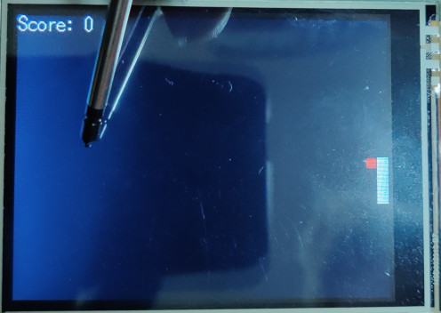
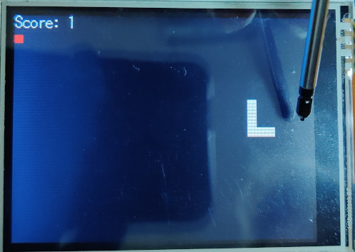
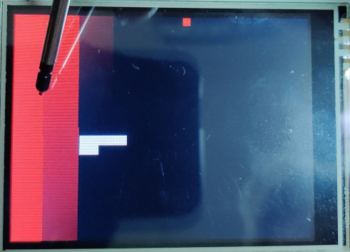

Opis projektu
=============

Głównym założeniem naszego projektu było napisanie prostej gry z obsługą
dźwięków przez DMA. Zdecydowaliśmy się na grę typu \"snake\" i
implementację dźwięków podczas zbierania jabłka oraz przegranej przy
zderzeniu głowy węża z jego ciałem.

Użyte przez nas dźwięki zostały w trakcie przygotowywania projektu
pobrane w formie bitowej z pliku *.wav* i zamienione w tablicę języka C
wartości obsługiwanych przez przetwornik DAC.

Montaż płytki
=============

Do płytki Open1768 podłączyliśmy:

-   moduł analogowy dla przetworników ADC i DAC,

-   ekran LCD *3.2inch 320x240 Touch LCD (C)*,

-   moduł debugowania do przesyłania programu z komputera.

Instrukcja obsługi
==================

Po uruchomieniu mikrokontrolera należy dokonać kalibracji poprzez
naciśnięcie wyświetlających się na ekranie krzyżyków.

Po zakończonej kalibracji gra automatycznie wystartuje, a wąż będzie
poruszał się w dół ekranu. W celu zmiany kierunku poruszania należy
dotknąć odpowiedniej części ekranu. Panel dotykowy jest podzielony na
dwie części, dotyk prawej połowy spowoduje skręt węża w prawo względem
jego kierunku poruszania, analogiczna sytuacja ma miejsce przy dotyku
lewej połowy.

W celu zdobycia punktów należy zjadać jabłka, które są czerwonymi
punktami na ekranie. Ich podniesienie sygnalizowane jest dźwiękiem
wydanym przy pomocy DMA.

W razie kiedy wąż zje własny ogon - przegrywa. Zapala się czerwony
ekran, wydawany jest charakterystyczny dźwięk, a rozgrywka zaczyna się
od nowa z zerem punktów.

Implementacja przesyłania dźwięku przez DMA
===========================================

Konfiguracja DMA
----------------

W rejestrze PCONP ustawiamy bit 29, włączając zegar dla DMA.

W rejestrze DMACConfig ustawiamy bit 0, włączając kontroler DMA.

Przerwanie DMA
--------------

W rejestrach DMACIntTCClear i DMACIntErrClr ustawiamy bit 0, czyszcząc
stany przerwania.

Konfiguracja przetwornika DAC
-----------------------------

Ustawiamy pin 0.26 na drugą funkcję, włączając DAC.

W rejestrze DACCTRL ustawiamy bity 2 i 3, co pozwala nam używać DMA do
kontrolowania przesyłania wartości na przetwornik. W rejestrze DACCNTVAL
wpisujemy wartość 2272, czym ustalamy częstotliwość przesyłania wartości
z DMA.

Odgrywanie dźwięku
------------------

W rejestrze DMACCSrcAddr wpisujemy adres tablicy z wartościami dźwięku
do przesłania.

W rejestrze DMACCDestAddr wpisujemy adres rejestru DACR, gdzie będziemy
przesyłać wartości dźwięku.

Rejestr DMACCLLI ustawiamy na 0, ponieważ nie wykorzystujemy
funkcjonalności LLI.

W rejestrze DMACCControl ustawiamy bity 26 i 31, a na bity 18-20 oraz
21-23 wpisujemy wartość 1. W ten sposób konfigurujemy rozmiar transferu
(16 bitów), włączamy autoinkrementację adresu źródła (dzięki temu
\"automatycznie\" przesyłamy całą tablicę) i ustawiamy bit potrzebny do
przerwania.

Włączamy przerwanie DMA.

W rejestrze DMACCConfig ustawiamy bity 14 i 15, na bity 6-10 wpisujemy
wartość 7, a na bity 11-13 wartość 1. W ten sposób ustawiamy odpowiednie
wartości do obsługiwania przerwania, wybieramy typ transferu \"memory to
peripheral\" i DAC jako cel transferu.

Implementacja węża
==================

Implementację gry oparliśmy o tablicę dwuwymiarową, o rozmiarze zależnym
od szerokości węża. Przeprowadzając jej liniową transformację na ekran.

Komórki tablicy mogą mieć w sobie jedną z poniższych wartości:

-   0 dla komórek pustych

-   \>1 dla komórek w których znajduje się wąż

-   -1 dla komórek z jabłkiem

Stworzyliśmy globalną zmienną całkowitą reprezentującą aktualne
położenie głowy węża, globalną zmienną wyliczeniową reprezentującą
kierunek jego poruszania i globalną zmienną całkowitą mówiącą o
aktualnej długości węża (początkowo równa 5, zwiększana o 2 z każdym
podniesionym jabłkiem).

Kiedy wąż się porusza, dla każdej komórki z wartością większą od 0
odejmowana jest jedynka. W zależności od wartości w zmiennej
wyliczeniowej zmienia się położenie głowy węża, sprawdzana jest
zawartość komórki i następuje jedna z trzech akcji:

-   dla 0 zmieniana jest wartość komórki na rozmiar węża

-   dla -1 krok analogiczny jak dla 0, losowane jest położenie kolejnego
    jabłka i zwiększana długość węża o 2

-   dla wartości większych od zera, czyli zderzenia z wężem, gra się
    resetuje, a użytkownik traci dotychczasowy wynik

Generowanie położenia jabłka zaimplementowaliśmy przy pomocy napisanego
przez nas liniowego generatora pseudolosowego, który za ziarno przyjmuje
kombinację liniową z odczytów współrzędnych panelu dotykowego podczas
kalibracji.

Dotyk ekranu w zależności od współrzędnych zmienia wartość zmiennej
wyliczeniowej w zależności od jej poprzedniego stanu.
